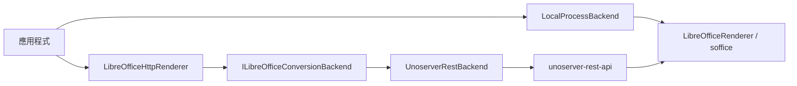

# 渲染 Backend 部署指南

本文件說明 `OdfKit.Extensions.Rendering` 的三種 LibreOffice 轉檔後端部署方式，
供開發、單機與容器化環境選型（Wave 3 REN-1）。

核心套件為**選用擴充**，不影響 `OdfKit` 建立／載入／保存能力。

## 架構概覽



| 元件 | 用途 |
|------|------|
| `ILibreOfficeConversionBackend` | 轉檔後端抽象（串流 in → 串流 out） |
| `LocalProcessBackend` | 本機 `soffice --headless` 子程序 |
| `UnoserverRestBackend` | HTTP 呼叫 `unoserver-rest-api` |
| `LibreOfficeHttpRenderer` | 文件層 API + 併發節流（預設接 Unoserver） |
| `LibreOfficeRenderer` | 低階檔案／文件轉檔（本機程序） |

## 後端選型

| 情境 | 建議後端 | 理由 |
|------|----------|------|
| 開發機、單一 Windows/Linux 工作站 | `LocalProcessBackend` | 零額外服務、設定最少 |
| Docker / K8s、多租戶 API | `UnoserverRestBackend` + `LibreOfficeHttpRenderer` | 程序池化、水平擴展 |
| 已有 `LibreOfficeRenderer` 整合 | 注入自訂 `LibreOfficeRenderer` 至 `LocalProcessBackend` | 保留路徑／逾時設定 |

## 1. 本機程序後端（LocalProcessBackend）

### 需求

- 已安裝 LibreOffice（建議 26.x，與互通矩陣一致）
- `soffice` 可從 PATH 或明確路徑執行

### 路徑解析

`LibreOfficeRenderer` 預設搜尋：

- `ODFKIT_SOFFICE_PATH`、`LIBREOFFICE_PATH`（可指向 `soffice` 檔案、安裝根目錄、`program` 目錄，或 LibreOffice Portable 根目錄）
- Windows：`C:\Program Files\LibreOffice\program\soffice.exe`
- macOS：`/Applications/LibreOffice.app/Contents/MacOS/soffice`
- Linux：`/usr/bin/soffice`、`/usr/bin/libreoffice`
- 找不到時 fallback 為 `soffice`（依 PATH）

可透過屬性覆寫：

```csharp
var renderer = new LibreOfficeRenderer
{
    LibreOfficePath = @"C:\Tools\LibreOffice\program\soffice.com",
    Timeout = TimeSpan.FromSeconds(120),
};
var backend = new LocalProcessBackend(renderer);
```

### 程式範例

```csharp
using OdfKit.Extensions.Rendering;
using OdfKit.Text;

using TextDocument document = TextDocument.Create();
document.AddParagraph("高 fidelity fallback 轉為 PDF");

await document.ConvertToPdfAsync("out.pdf", cancellationToken);
```

`LibreOfficeConversionFormats` 提供常用 fallback 格式常數。跨格式輸出預設應優先使用
核心套件已提供的 managed 路徑；本套件保留 LibreOffice 作為高 fidelity 或未 managed 化格式的
fallback。

### 串流後端範例

```csharp
using OdfKit.Extensions.Rendering;

var backend = new LocalProcessBackend();
using MemoryStream input = new();
document.SaveToStream(input);
input.Position = 0;

using Stream pdf = await backend.ConvertAsync(input, "odt", "pdf", cancellationToken);
```

### 運維注意

- 每次轉檔使用獨立 `UserInstallation` 設定檔目錄，避免多程序鎖定衝突
- 預設逾時 60 秒；大檔或冷啟動建議調高 `Timeout`
- 支援 `CancellationToken`（見 `LocalProcessBackendAsyncCancellationTests`）

## 2. Unoserver REST 後端（UnoserverRestBackend）

### 需求

- 執行中的 [unoserver](https://github.com/unoconv/unoserver) + `unoserver-rest-api`
- 預設端點：`http://localhost:2004/request`

### 容器化示意

```bash
# 依實際映像與版本調整；以下為部署概念示意
docker run -d --name unoserver -p 2004:2004 <unoserver-rest-image>
```

服務就緒後，以 HTTP multipart 上傳 `file` 與 `convert-to` 欄位（由 `UnoserverRestBackend` 封裝）。

### 程式範例

```csharp
using OdfKit.Extensions.Rendering;

var backend = new UnoserverRestBackend("http://unoserver:2004/request");
using var renderer = new LibreOfficeHttpRenderer(backend, maxConcurrentCalls: 8);

using var output = File.Create("out.pdf");
await renderer.ConvertAsync(document, output, "pdf", cancellationToken);
```

### 運維注意

- 內建最多 3 次重試（`HttpRequestException` / 逾時）
- 共用 `HttpClient` 連線池（`MaxConnectionsPerServer = 100`）
- 生產環境請於反向代理後設定健康檢查與資源上限

## 3. LibreOfficeHttpRenderer（文件層 + 節流）

封裝 `OdfDocument.SaveToBytes()` → 後端轉檔 → 寫入輸出串流。

- 預設後端：`UnoserverRestBackend`
- 預設 `maxConcurrentCalls = 4`（`SemaphoreSlim` 節流）
- 自動依 ODF 文件種類選副檔名：`odt` / `ott` / `odm` / `ods` / `ots` / `odp` /
  `otp` / `odg` / `otg` / `odc` / `odf` / `odi` / `odb` 與 Flat XML 變體

單元測試以 `ILibreOfficeConversionBackend` mock 驗證併發與取消，無需真實 LibreOffice。

## 環境變數對照

| 變數 | 用途 | 相關腳本／測試 |
|------|------|----------------|
| `ODFKIT_SOFFICE_PATH` | 本機 `soffice` 路徑 | `eng/Test-LibreOfficeInterop.ps1`、`OfficeInteropConversionTests` |
| `LIBREOFFICE_PATH` | 同上（相容別名） | `LibreOfficeInteropTests` |
| — | Unoserver 端點由建構函式指定 | `UnoserverRestBackend(endpoint)` |

## 驗證

```powershell
# 單元測試（不需真實 LibreOffice）
pwsh eng/Test-RenderingBackends.ps1

# 本機 soffice 互通（可選）
pwsh eng/Test-LibreOfficeInterop.ps1
```

相關測試類別：

| 測試 | 說明 |
|------|------|
| `LibreOfficeHttpRendererTests` | Mock 後端、併發節流、取消 |
| `LocalProcessBackendAsyncCancellationTests` | 本機後端取消語意 |
| `PresentationAndRenderingTests` | MockSoffice 轉檔流程 |
| `LibreOfficeRenderer*Tests` | 逾時、路徑、錯誤處理 |

## 限制與非目標

- 本套件不代表 OdfKit 的主要轉檔策略；已 managed 化的 HTML / Markdown / RTF / PDF /
  OOXML / CSV 路徑應優先使用對應 extension
- 不提供完整物理分頁或像素級版面渲染；ODG -> SVG 的 managed 向量匯出基礎由
  `OdfKit.Extensions.Html` 提供，高保真頁面渲染仍可 fallback 到 LibreOffice
- `OdfKit.Extensions.Imaging` 的 SkiaSharp 文字量測與本套件無直接相依
- 不保證與所有 LibreOffice 版本像素級一致；互通驗收以 26.x 為準

## 相關文件

- [libreoffice-interop-matrix.md](libreoffice-interop-matrix.md) — headless 載入／轉換矩陣
- [ooxml-visual-golden-matrix.md](ooxml-visual-golden-matrix.md) — OOXML 視覺比對
- [interop-corpus.md](interop-corpus.md) — corpus 與可選驗收腳本總覽
